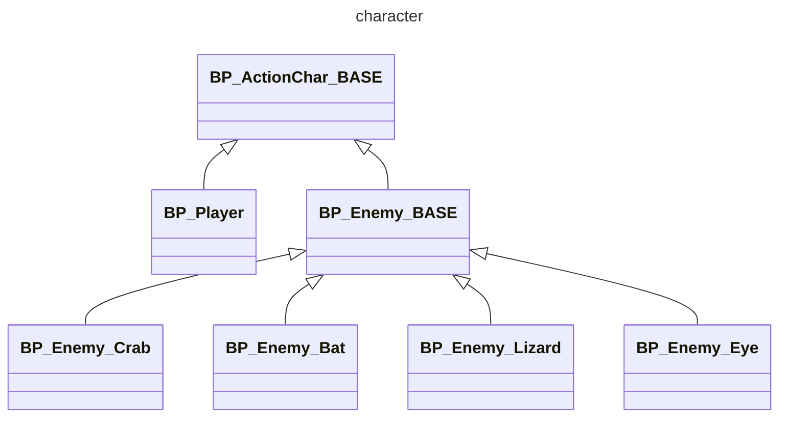
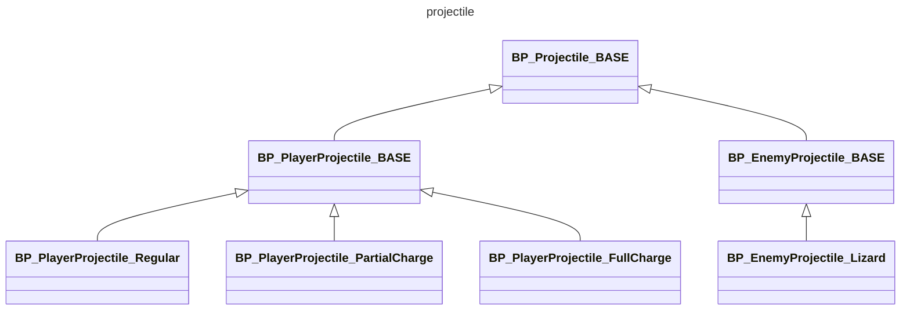

# MegaActionPlatformer

Developed with Unreal Engine 5

Character

```mermaid
---
title: character
---
classDiagram
	BP_ActionChar_BASE <|-- BP_Player
	BP_ActionChar_BASE <|-- BP_Enemy_BASE
	BP_Enemy_BASE <|-- BP_Enemy_Crab
	BP_Enemy_BASE <|-- BP_Enemy_Bat
	BP_Enemy_BASE <|-- BP_Enemy_Lizard
	BP_Enemy_BASE <|-- BP_Enemy_Eye


```

Projectile

```mermaid
---
title: projectile
---
classDiagram
BP_Projectile_BASE <|-- BP_PlayerProjectile_BASE
BP_Projectile_BASE <|-- BP_EnemyProjectile_BASE
BP_PlayerProjectile_BASE <|-- BP_PlayerProjectile_Regular
BP_PlayerProjectile_BASE <|-- BP_PlayerProjectile_PartialCharge
BP_PlayerProjectile_BASE <|-- BP_PlayerProjectile_FullCharge
BP_EnemyProjectile_BASE <|-- BP_EnemyProjectile_Lizard
```

