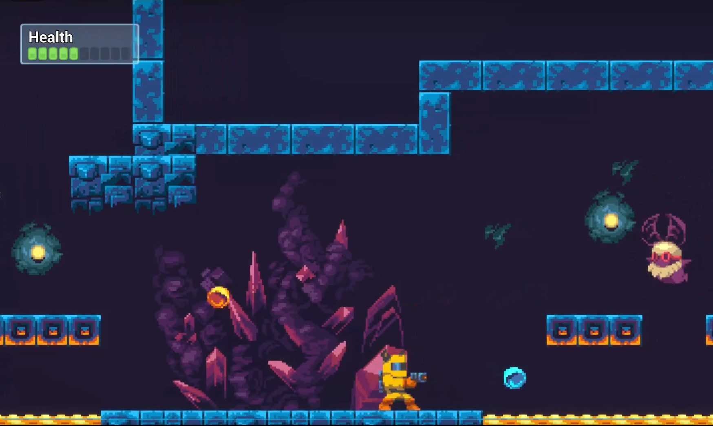
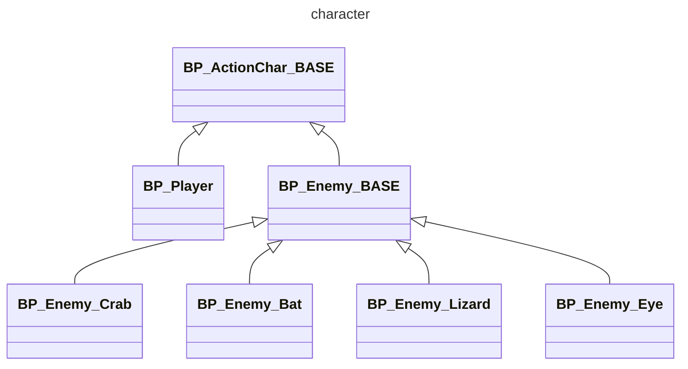
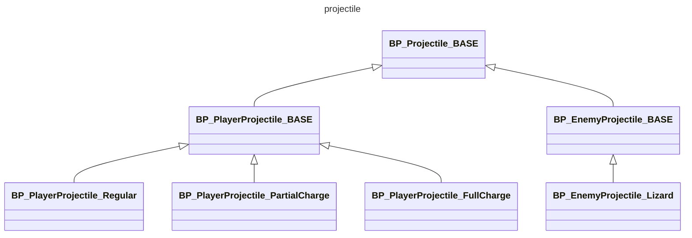

# MegaActionPlatformer

Here we try to develop a 2D game with UE5. What It contains:

- Make an Action Platformer similar to the Mega Man Series
- Unreal Engine Blueprints, starting from the basics up to advanced usage
- Character abilities such as Wall Jumping, Sliding and more
- Different types of 2D projectiles and shooting
- Create 4 different types of Enemies and their AI
- Create 2D levels with tile sets and tile maps
- Best Practices for 2D and 2D/3D hybrid games in Unreal Engine
- Make a dynamic camera system

 

Character

Projectile

